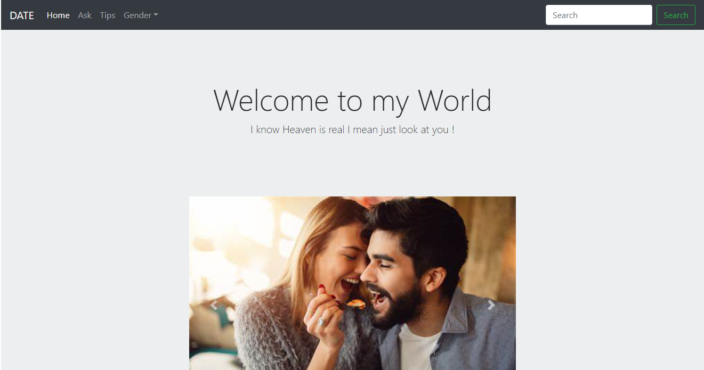

# One-Page-Layout.io
This project aims to recreate a pixel perfect design and make a one-page responsive layout
This template comes loaded with a host of unique layouts. Also, it brings before you a series of challenges that Web Developers often face in real-world scenarios. 
As a result, you are pushed to experiment with new technologies like Floats and Flexbox to hone the implementation of CSS layout techniques.

